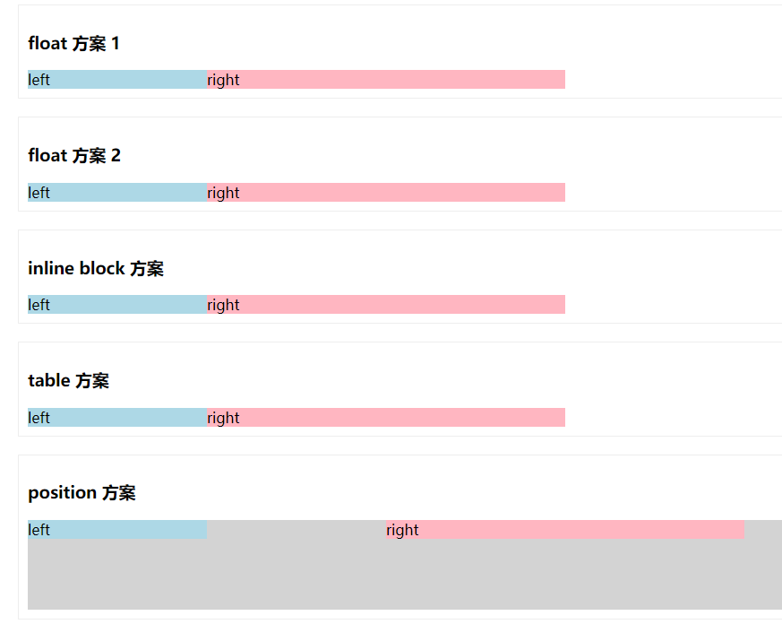

# CSS常用布局方案 —— 双栏布局

    <!DOCTYPE html>
    <html lang="en" dir="ltr">
        <head>
            <meta charset="utf-8">
            <title>双栏布局</title>
        
    </head>
    <body>
        

            <h3>float 方案 1</h3>
            

                

                    left
                

                

                    right
                

            

        

        

            <h3>float 方案 2</h3>
            

                

                    left
                

                

                    right
                

            

        

        

            <h3>inline block 方案</h3>
            

                

                    left
                

                

                    right
                

            

        

        

            <h3>table 方案</h3>
            

                

                    left
                

                

                    right
                

            

        

        

            <h3>position 方案</h3>
            

                

                    left
                

                

                    right
                

            

        

    </body> 
    </html>      

