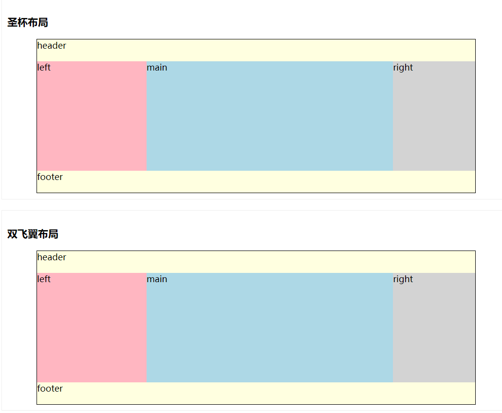

# CSS常用布局方案 —— 三栏布局

    <!DOCTYPE html>
    <html lang="en" dir="ltr">
        <head>
            <meta charset="utf-8">
            <title>三栏布局</title>
            
        </head>
        <body>
            

                <h3>圣杯布局</h3>
                

                    

                        header
                    

                    

                        <!-- 本来应该按照 left main right 的顺序写 HTML, 但是想让主体部分 main 更快加载, 所以把 main 写在最前面 -->
                        

                            main
                        

                        

                            left
                        

                        

                            right
                        

                    

                    

                        footer
                    

                

            

    
            

                <h3>双飞翼布局</h3>
                

                    

                        header
                    

                    

                        

                            

                                main
                            

                        

                        

                            left
                        

                        

                            right
                        

                    

                    

                        footer
                    

                

            

        </body>
    </html>
